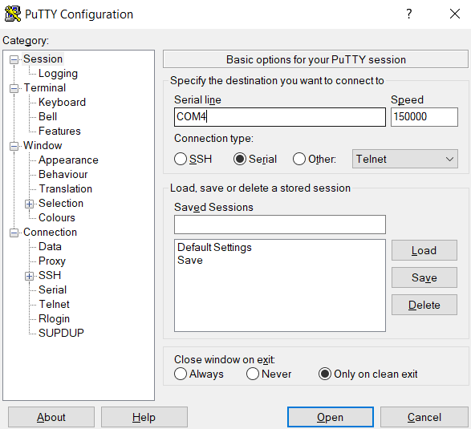

# Final Project

## Running the project

After the binary has been flashed with:

```
final> st-flash --reset write ./bin/firmware.bin 0x08000000
```

You can connect with the project using a serial client. Using pyserial:

```
python -m serial.tools.miniterm COM4 1500000 -f direct
```

You can also use PuTTy:


Note that the baud rate is now **1,500,000**

## Using the custom serial client

As noted in my video demo, to properly use the extra DAS features of the project, you need run the custom serial client that uses tkinter and pyserial. This is only required for sending keyup events, so the vaste majority of the features can still be tested without it (it's as if the user is always holding down a key).

### Sharing the serial port

Before we install this client we need to get around a problem. Unfortunatly, windows does not allow different programs to share a serial port...

The only way around this issue I've found is to set up the client in WSL which allows this. I tried to use a serial port splitter (https://www.serial-port-splitter.com/serial-port-splitter-download.html), and while I got it working on the milestone 1 version of the project, it screws up the VT100 codes I used to get color making it unusable for this version.

#### Setting up the terminal client in WSL

Before you install WSL, you need to enable the feature set. Run the following as admin

```
Enable-WindowsOptionalFeature -Online -FeatureName Microsoft-Windows-Subsystem-Linux
```

Firstly you need to install a wsl distro. (I used ubuntu). You can install it with this command

```
wsl --install -d Ubuntu
```

This will ask you for a username and password to set up your linux user.

I recommend to connect to it, to use the WSL extention in VSCode.

Just open VSCode search WSL, and it's the one by microsoft. (Extention ID: ms-vscode-remote.remote-wsl)

Using that extention

1. Type: Windows-Key-Shift-P to open the vscode command pallete
2. Search "WSL: Connect to WSL using Distro..."
3. Select Ubuntu

This will now connect you to your WSL instance.

##### Setting up the serial port

Another windows pain. Microsoft has removed the ability for WSL to talk to the windows COM ports in WSL 2.0.

To get around this we will install a program called usbipd. This essentially hijacks the serial port and hosts a proxy socket that the WSL distro can connect to.

On your windows machine, install usbipd: https://github.com/dorssel/usbipd-win

Open in powershell, and list the currently available serial ports

```
usbipd list
```

Note the ST-Link Bus ID (Mine was 1-1, but your machine could be different). Attach it to WSL with this command

```
usbipd wsl attach --busid 1-1 --distribution Ubuntu
```

You'll hear the device disconnect after that. Now in WSL, you should note what device it got installed to. Run the following to figure out the device file.

```
ls /dev/tty*
```

The one that starts with /dev/ttyACM, should be the linked device. (Mine was /dev/ttyACM0). This will be used in place of the COM port to connect to it.

With all of that set up, you can now simply clone my repo, to get the python code to run the terminal

```
git clone https://github.com/Daniil-Aleshechkin/tetris-rtos.git
```

### Installing dependancies

Ensure you have python installed. Any version of python 3 should be fine (This was developed on 3.8, due to arm-none-eabi-gdb requiring it).

**Note:** On WSL Ubuntu python is pre-installed as python3, there's a convient package to add a symlink to python3

```
sudo apt-get install python-is-python3
```

The only dependancies are tkinter and pyserial. Tkinter should be packaged by default, and you can test if you have it installed with.

```
python -m tkinter
```

Pyserial can be installed with

```
pip install pyserial
```

### Using a virtual environment

Alternatevly you can also use the built in virtual environment activating it by running the powershell script.

```
final> ./tetris-rtos/bin/Activate.ps1
```

**Important!** Make sure you have your powershell execution policy set to unrestricted. I'm not sure if this is a requirement with python virtual environment nowadays, but it's a common gotcha when running powershell scripts.

You can set it using the command:

```
Set-ExecutionPolicy Unrestricted
```

Or bash script if in WSL

```
final> source .\tetris-rtos\bin\activate
```

Once python is installed with all the dependancies

```
final> python ./terminal/terminal.py **SERIAL PORT HERE**
```

**Note:** When running this on windows, you may see an error about "xset not being found". xset is a tool I used in linux to disable the auto repeat of keys when you hold it by the system. Windows doesn't have this installed so it's likely it will throw something. The program should still run fine though.

This will open a tkinter window. Click the window to focus it, so it will start capturing keyboard events.

**Note:** if on WSL, pyserial is the only method I know of reading the serial port. Quitting pyserial is a little unintuative It uses the keys "CTRL-]"

```
python -m serial.tools.miniterm /dev/ttyAMC0 1500000 -f direct
```

## Using the project

### Controls

The controls hardcoded to the following when directly connected to USART
**Note:** Make sure num-lock is on. If it's off, I've noticed the keys do not get picked up.

- D: Hard drop
- S: Soft drop
- W: 270 rotate
- Q: 180 rotate
- R: Reset Board
- Tab: Hold piece
- Numpad 4: Move left
- Numpad 6: Move right
- Numpad 8: Rotate 90
- Numpad 5: Softdrop
- P: Exit to CLI

The controls when connected using the custom serial client are the following:

- D: Hard drop
- S: Soft drop
- W: 270 rotate
- Q: 180 rotate
- R: Reset Board
- Tab: Hold piece
- Arrow Right: Move left
- Arrow Left: Move right
- Arrow Up: Rotate 90
- Arrow Down: Softdrop
- P: Exit to CLI

## CLI Commands

The commands should be case insensitive

Help: Displays a help screen with some information about what commands are available
DAS N: Set the DAS delay value to whatever N is. This is amount of ticks, in the DAS task, because I couldn't get the timer to work due to the same linking issue with the interupts. So, there is unfortunatly no real world equivalent to it.
ARR N: Set the ARR delay value to whatever N is. Same as DAS delay: No real world equivalent.
dasenable: Enable the DAS feature
dasdisable: disable the DAS feature
quit: Return back to the game

# Known Bugs

Tetris will randomely crash on occasion. Only solution is to reset the board. I thought putting the tetris state behind a mutex would fix this, but it didn't (It's not a memory issue as I have it spamming Us if it is out of memory).

The softdrop will not register that you released the key on occasion. The only solution is just to press the softdrop key again.

Sometimes when clearing the board, some blocks get copied instead of cleared. This is a bug from my previous project that was inherited because I didn't modify the Tetris Domain code at all.
