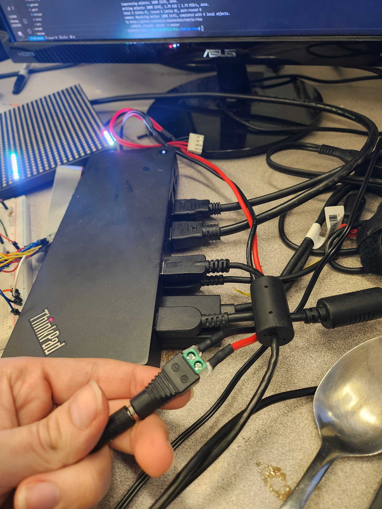

# LED Matrices

## Project Description

This project was aimed at developing drivers for LED matrices and exploring potential applications for these drivers. Two distinct drivers were developed: one for an 8x8 matrix powered by NeoPixel LEDs (WS-2812) and another for a 32x32 matrix from SparkFun (COM-14646). The applications developed include a graphical user interface (GUI) for a Tetris game (My project from 452) and a video player capable of playing the music video "Bad Apple."

## Project Design

### WS-2812 Driver
This driver is based on the STM32F103FastNP library (https://github.com/evilwombat/stm32f103_fastNP) which uses the technique from this block post  https://www.martinhubacek.cz/blog/stm32-ws2812b-dma-library/. The protocol for sending data is time-sensitive, requiring a single serial connection via one pin.

In this protocol:
- A 'zero' is represented by a short pulse.
- A 'one' is represented by a long pulse.
- A reset signal, indicated by a prolonged low signal, marks the end of the data transmission.

The implementation employs DMA and Timer 2:
1. The first DMA channel triggers on Timer 2's start event, sending a byte with all bits set to '1' to the BSRR register to turn the pin high.
2. The second channel sends a byte from our buffer to the BRR register, where a bit '1' resets the pin for a short pulse.
3. The final channel sends a constant '1' to the BRR for the long pulse.
4. The reset signal is executed by turning off the timer after data processing.

The use of the DMA channels, and timer allowed the stm-32 to send protocal data quickly and reliably as it is decoupled from interupts from the CPU.

### COM-14646 Driver
This driver controls the 32x32 LED matrix, differing significantly from the WS-2812-based 8x8 matrix. It involves manipulating only two of the 32 rows at a time via a shift register, with 13 total pins: 6 for data (RGB values for each row) and 7 for control.

Operations are as follows:
- Data is input, followed by a clock pulse, repeated 32 times.
- A latch pulse is then sent to display the rows.
- The output enable pin turns the rows on or off, which is crucial during row transitions.

The driver operates by sending RGB values and clock pulses for each pixel, waiting via a timer to ensure visibility, and then using the output enable pin to transition between row pairs. This process continues cyclically as only two rows are visible at any given time. Given this limitation, the rows must be 

### Tetris GUI Integration
This integration was designed with the original project framework in mind. The existing print task, which runs concurrently with the input task, was modified to use the display driver instead of displaying a text representation of the Tetris board.

### Bad Apple Video Player

This application uses the 32x32 driver to display frames from the "Bad Apple" music video. Each frame is represented by 128 bytes, with each bit corresponding to a pixel in the black and white video. With a need for 1024 pixels per frame and a limitation on flash storage, only about 900-1000 frames can be stored at any time. 

The system operates with two main tasks:
- An input task that reads frames from a USART serial input into a framebuffer.
- A print task that displays the frames.

A major engineering challenge was the real-time transmission and reception of frames over USART which has a risk of data loss. To manage this, a specific byte is sent to indicate readiness for frame transmission, which prompts the corresponding tasks on the sender and receiver sides to coordinate frame transfer effectively. The video runs at approximately 30 frames per second, facilitated by a timer-controlled buffer that runs at 32 Hz.

# Project Testing

Testing was done using a voltameter to measure the maximum current draw of the 32x32, and the ADALM to measure the timing of a refresh.

The full 32x32 would consume up to 2.5A.

A full refresh of the display took 10ms.

A full frame takes up only 3 kB of RAM, and I had a 7 frame buffer on the video player which takes up an additional 896 byte.

Then both the bad apple video player, and the tetris application were tested by using the application and ensuring it behaves as expected.

The Tetris application still crashes occasionelly, but the crashes were consistent only to piece dropped. Before with the old terminal GUI crashes would happen intermittently. A memory leak is likely the cultprit of the issue. Additionelly as none of the tetris code was touched, there are still bugs with the piece placement. Sometimes the piece will spawn outside the bounds of the board, and sometimes the board will be cleared incorrectly spawning blocks at the top of the game board where they shouldn't be.

The bad apple video player will occaisonelly lag and miss frames thus becoming desynced with the song, however it will still play the video to completion and function without needing a reset. 

# Project Usage

## Project assembly

### 8x8 Matrix

The 8x8 can be powered directly using the board. The only data pin my library supports is PB0. 

### 32x32 Matrix

The 32x32 cannot be powered by the board and needs to be powered using the 1A power cable provided. Simply screw on the attachment on the cable pin then place the ground and VCC inside the screwed attachment like the following:

Once that is done the pinout needs to be assembled. 

There's no datasheet unfortunatly, but there's a guide that can be found here with a pinout diagram: https://learn.adafruit.com/32x16-32x32-rgb-led-matrix/new-wiring. (See the layout for 32x32, Variant A)

The following 13 GPIO needs to be connected:

PB0 -> R1
PB1 -> G1
PB2 -> B1
PB6 -> R2
PB9 -> B2
PB8 -> G2
PC5 -> A
PC2 -> B
PC3 -> C
PC6 -> D
PA9 -> OE
PA1 -> LAT
PA0 -> CLK
GND -> (all 4 ground pins)

## Build and Flashing instructions

### Tetris-RTOS

Source: https://github.com/Daniil-Aleshechkin/tetris-rtos

First you must build the make files with cmake. Run the following cmake command:

cmake -DPROJECT_NAME=firmware -DCMAKE_BUILD_TYPE=Debug -DDUMP_ASM=OFF

Then run:

make

After the project is built it can be flashed with st-flash:

st-flash --reset write ./firmware.bin 0x08000000

### Bad-Apple video player

Source: https://github.com/Daniil-Aleshechkin/bad-apple

Like Tetris-RTOS this must be built with cmake then flashed with st-flash

cmake -DPROJECT_NAME=firmware -DCMAKE_BUILD_TYPE=Debug -DDUMP_ASM=OFF
make
st-flash --reset write ./firmware.bin 0x08000000

### WS-2812 driver

Source: https://github.com/Daniil-Aleshechkin/cmsis-ws2821-controller

The driver is supplied in a keil uvision project and can be built and flashed via Keil. There is a sample demo animation that plays after it is flashed on the board.

### COM-14646 driver

Source: https://github.com/Daniil-Aleshechkin/com-14646

The driver is supplied in a keil uvision project and can be built and flashed via Keil. There is a sample demo animation that plays after it is flashed on the board.

## Project Functions and Features

### Tetris-RTOS

The application can be run in two ways, either using a custom serial client (This is required for the auto repeat feature), or just with a direct serial connection.

Connecting directly can be done with pyserial on linux:

python -m serial.tools.miniterm **SERIAL PORT HERE** 1500000 -f direct

The terminal client must be run after switching to the virtual environment. 

source ./tetris-rtos/bin/activate

Then it can simply be run with

python ./terminal/terminal.py **SERIAL PORT HERE**

#### Controls

The controls hardcoded to the following when directly connected to USART
**Note:** Make sure num-lock is on. If it's off, I've noticed the keys do not get picked up.

- D: Hard drop
- S: Soft drop
- W: 270 rotate
- Q: 180 rotate
- R: Reset Board
- Tab: Hold piece
- Numpad 4: Move left
- Numpad 6: Move right
- Numpad 8: Rotate 90
- Numpad 5: Softdrop
- P: Exit to CLI

The controls when connected using the custom serial client are the following:

- D: Hard drop
- S: Soft drop
- W: 270 rotate
- Q: 180 rotate
- R: Reset Board
- Tab: Hold piece
- Arrow Right: Move left
- Arrow Left: Move right
- Arrow Up: Rotate 90
- Arrow Down: Softdrop
- P: Exit to CLI

#### CLI Commands

The commands should be case insensitive

Help: Displays a help screen with some information about what commands are available
DAS N: Set the DAS delay value to whatever N is. This is amount of ticks, in the DAS task, because I couldn't get the timer to work due to the same linking issue with the interupts. So, there is unfortunatly no real world equivalent to it.
ARR N: Set the ARR delay value to whatever N is. Same as DAS delay: No real world equivalent.
dasenable: Enable the DAS feature
dasdisable: disable the DAS feature
quit: Return back to the game
version: Displays the parent commit, and the date of the commit. 

### Bad-apple video player

The video player is run using another python script supplying the serial port file in the arguments just like the serial client for the tetris-rtos project.

First activate the virtual environment:

source ./bad-apple/bin/activate

python ./terminal/terminal.py **SERIAL PORT HERE**

This will cause the song to play and the video to be displayed.

# Project changes

The project during development underwent multiple changes from the original requirements. Originally the plan was to integrate a PS2 keyboard using a similar method with the DMA. 

There would have been an interupt on the PS/2 clock pin which would trigger a DMA transfer. This would transfer all the bits of the PS2 into an input buffer. Then the input task would poll the DMA, and if there was a full transfer, it would then take the bytes from the buffer and reconstruct the scan code. Then it would decode the scan code and execute the mapped actions. 

This integration would make inputs more reliable to injest as USART bytes would often get eaten if the player played too fast. Unfortunatly, I was unable to get the keyboard to send data when it was powered. Only the 3 indicator LEDs would turn on then blink.

Instead, I created the bad-apple video player which was another project that I wanted to do with my display driver.